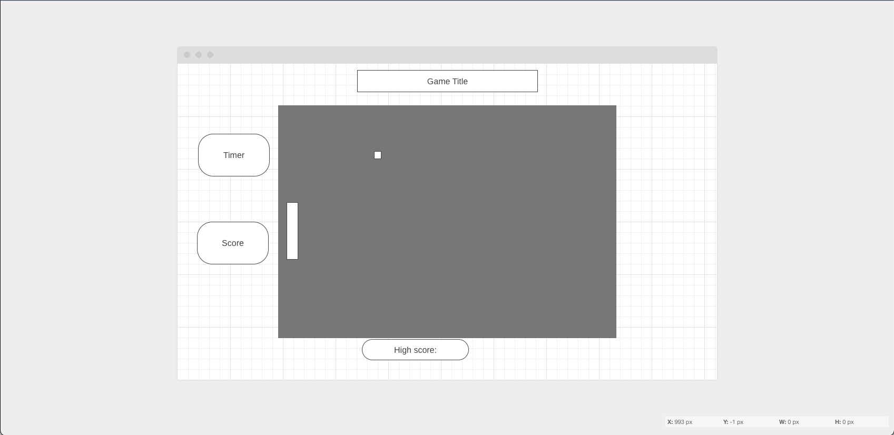

Game: Snake! 
https://snake-gamee.surge.sh/

Instructions : 
- Grab as many apples as you can! Avoid your body at all costs!

What I learned? 
CANVAS.JS and Scalable Vectoral Graphics (SVG)!!!!!! I was only able to scratch the surface of what you can do with canvas. My original plan was to use canvas to render a 3D, however that proved too difficult. I look forward to contiuning my research on 3D rendering. 

Wireframe: 
 

ScreenShot: 
 

Tech Used: 
HTML CSS JS HTML.Canvas(Canvas.js) 

Future improvments! 
- Adding a score board 
- adjusting velocity aspect and create a button specifically for that 
- add character animation for snake and apple 
- add sound 
Working on implenting a 2D to 3D conversion aspect + 360 rotation. 
Will update.  

Sources: 
2D rendering concepts 
https://developer.mozilla.org/en-US/docs/Web/API/CanvasRenderingContext2D
https://developer.mozilla.org/en-US/docs/Web/API/WebGL2RenderingContext
https://medium.com/@benjamin.c.coleman/the-beginners-guide-to-beginning-three-js-c36b8947c2aa

Animation 
https://developer.mozilla.org/en-US/docs/Web/API/window/requestAnimationFrame

Logic for Canvas Grid mapping 

https://xon5.medium.com/flexible-canvas-grid-without-blurred-lines-907fcadf5bfc
https://www.w3schools.com/html/html5_canvas.asp 
https://developer.mozilla.org/en-US/docs/Web/API/Canvas_API

Scalable Vector Graphics (SVG) 

https://developer.mozilla.org/en-US/docs/Web/SVG
https://www.w3schools.com/html/html5_svg.asp

using SVG element rect 
 https://developer.mozilla.org/en-US/docs/Web/SVG/Element/rect
